# Classifying-the-visibility-of-ID-cards-in-photos-in-Keras
Classifying the visibility of ID cards in photos using Keras
# Ahad Aghapour

## Classifying the visibility of ID cards in photos.

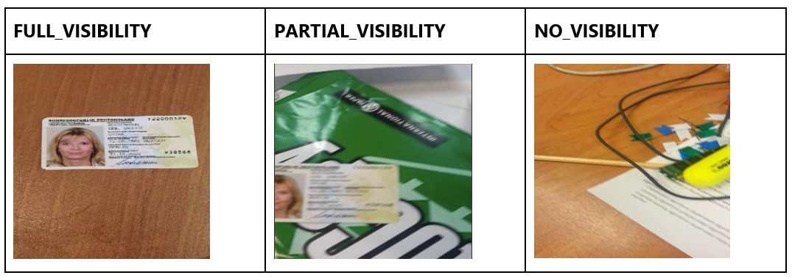

But, the sensor used when taking these photos was damaged and the photos are corrupted, as the images below show:

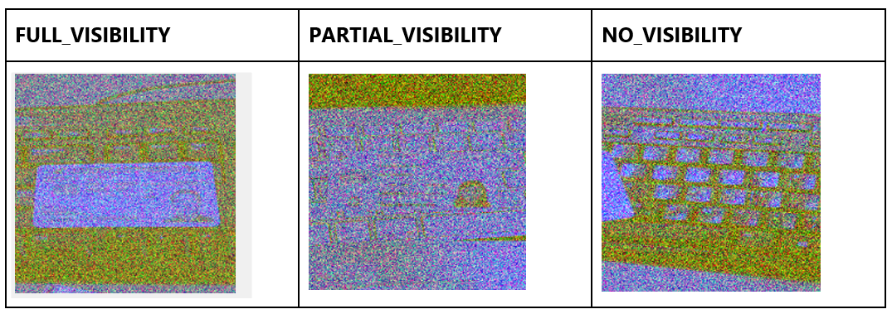

 

### imports


```python
import numpy as np
import pandas as pd
from sklearn.model_selection import train_test_split
from sklearn.preprocessing import StandardScaler, OneHotEncoder, LabelEncoder
import matplotlib.pyplot as plt
```


```python
import cv2
```


```python
from keras.preprocessing.image import ImageDataGenerator
```

    Using TensorFlow backend.
    


```python
from keras.applications.vgg16 import VGG16
```


```python
from keras.models import Sequential
from keras.models import model_from_json
from keras.models import load_model
from keras.utils import np_utils
```


```python
from keras.layers import Conv2D
from keras.layers import MaxPooling2D
from keras.layers import Flatten
from keras.layers import Dense
from keras.layers import Dropout
```


```python
%matplotlib inline
```

### Functions


```python
# return one hot encoded of y labels
def one_hot_encoder(array):
    unique_values , indices = np.unique(array, return_inverse=True)
    print('unique_values', unique_values)    
    one_hot_encoded_encoded_data = np_utils.to_categorical(indices, len(unique_values))    
    return one_hot_encoded_encoded_data
```


```python
# convert 1 channel image numpy array to 3 channels image numpy array
def GrayscaleImageArray2RGB(X):
    X3Channel = np.zeros((X.shape[0], X.shape[1], X.shape[2], 3))
    for i in range(X.shape[0]):
        X3Channel[i] = cv2.merge((xTrain[i,:,:,:], xTrain[i,:,:,:], xTrain[i,:,:,:]))
    return X3Channel
```


```python
# Read 3 channel RGB images and insert  them to the list and save the correct denoised channel to disk if you want
def readRGBImages2List(imageNames, imagesPath, denoisedImagePath, save2disk=False):
    X = []
    for imageName in imageNames:
        imageAddress = imagesPath + imageName
        image=cv2.imread(imageAddress)
        X.append(image)
        if save2disk:
            b,g,r = cv2.split(image)
            cv2.imwrite(denoisedImagePath + imageName, b)
       
    return X
```


```python
# convert 3 channel RGB and noisy image to clear grayscale 1 channel 
def denoisedRGB2OneChannel(images):
    return [image[:,:, 0].reshape(img_rows, img_cols, 1) for image in images]
```


```python
# this function return labelEcoder of each label
def myLabelEncoder(y_captions):
    y = LabelEncoder().fit_transform(y_captions)  
    return y
```


```python
# this function generate augmented image is suitable for NO_VISIBILITY Images
# Because the cropping, shifting, zooming and Shearing doesn't make to change the class type
def ImageDataGenerator4NoVisibleImages(X_NO_VISIBILITY, count):
    gen = ImageDataGenerator(rotation_range=15, width_shift_range=0.1, height_shift_range=0.1,
                        shear_range=0.15, zoom_range=0.1, horizontal_flip=True, vertical_flip=True)
    aug_iter = gen.flow(np.array(X_NO_VISIBILITY))
    X_NO_VISIBILITY_Augmented = [next(aug_iter)[0].astype('uint8') for i in range(count)]
    return X_NO_VISIBILITY_Augmented
```


```python
# this function generate augmented image is suitable for PARTIAL_VISIBILITY Images
# I didn't use cropping, shifting, zooming and Shearing because they may cause to be changing the class of image 
# for example it can be caused to eliminating the ID card completely and going to NO_VISIBILITY class
def ImageDataGenerator4PartialVisibleImages(X_PARTIAL_VISIBILITY, count):
    gen = ImageDataGenerator(rotation_range=15, horizontal_flip=True, vertical_flip=True)
    aug_iter = gen.flow(np.array(X_PARTIAL_VISIBILITY))
    X_PARTIAL_VISIBILITY_Augmented = [next(aug_iter)[0].astype('uint8') for i in range(count)]
    return X_PARTIAL_VISIBILITY_Augmented
```

### Global Variables


```python
# for training
csvFileAddress = '../data/gicsd_labels.csv'
imagePath = '../data/images/'
denoised_imagePath = '../data/imagesDenoised/'
```


```python
# for testing
test_csvFileAddress = '../data/Test_gicsd_labels.csv'
test_imagePath = '../data/images/'
```


```python
num_class=3
img_rows, img_cols = 192, 192
```

### Read CSV file 


```python
# Read csv file to dataframe
data = pd.read_csv(csvFileAddress, header=0)
data.head()
```


<div>
<style scoped>
    .dataframe tbody tr th:only-of-type {
        vertical-align: middle;
    }

    .dataframe tbody tr th {
        vertical-align: top;
    }

    .dataframe thead th {
        text-align: right;
    }
</style>
<table border="1" class="dataframe">
  <thead>
    <tr style="text-align: right;">
      <th></th>
      <th>IMAGE_FILENAME</th>
      <th>LABEL</th>
    </tr>
  </thead>
  <tbody>
    <tr>
      <th>0</th>
      <td>GICSD_1_0_3.png</td>
      <td>FULL_VISIBILITY</td>
    </tr>
    <tr>
      <th>1</th>
      <td>GICSD_1_0_13.png</td>
      <td>FULL_VISIBILITY</td>
    </tr>
    <tr>
      <th>2</th>
      <td>GICSD_1_1_33.png</td>
      <td>PARTIAL_VISIBILITY</td>
    </tr>
    <tr>
      <th>3</th>
      <td>GICSD_1_1_53.png</td>
      <td>FULL_VISIBILITY</td>
    </tr>
    <tr>
      <th>4</th>
      <td>GICSD_1_2_73.png</td>
      <td>FULL_VISIBILITY</td>
    </tr>
  </tbody>
</table>
</div>


### Read images to a list and show some of them
After investigating on the images, I find out that two channels of these images have noise but one channel has no noise, then I used the true channel


```python
# Read original images from disk and insert them to a list
X = readRGBImages2List(data.values[:,0], imagePath, denoised_imagePath, save2disk=True)
np.array(X).shape
```


    (800, 192, 192, 3)


```python
# Plot some of original images
for i in range(1, 10):
    plt.subplot(3, 3, i)
    plt.imshow(X[i])
```


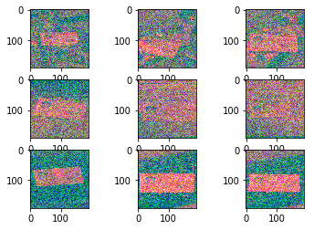


I selected the true channel


```python
# Denoising the image and select channel which has not noisy
X = denoisedRGB2OneChannel(X)
np.array(X).shape
```


    (800, 192, 192, 1)


```python
# Plot some of denoised images in grayscale mode
for i in range(1, 10):
    plt.subplot(3, 3, i)
    plt.imshow(X[i].reshape(img_rows, img_cols), cmap='gray')
```


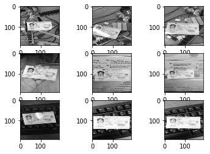


### Checking the dataset to be balance


```python
data.iloc[:, 1].value_counts().plot(kind='bar')
print(data.iloc[:, 1].value_counts())
```

     FULL_VISIBILITY        646
     PARTIAL_VISIBILITY     123
     NO_VISIBILITY           31
    Name:  LABEL, dtype: int64
    


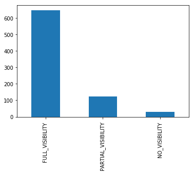


from the classes count we find out our dataset is imbalanced and we should balance the dataset by using augmented image data

#### use label encoder to use indexes instead of a text
     FULL_VISIBILITY index = 0
     PARTIAL_VISIBILITY index = 2
     NO_VISIBILITY index = 1   


```python
# datalabelEncoder = LabelEncoder()
# y = datalabelEncoder.fit_transform(data.values[:, 1])
y = myLabelEncoder(data.values[:, 1])
y.shape
```


    (800,)


```python
np.array(X).shape
```


    (800, 192, 192, 1)


## Using augmented data to balance the dataset


```python
plt.hist(y, 3)
```


    (array([646.,  31., 123.]),
     array([0.        , 0.66666667, 1.33333333, 2.        ]),
     <a list of 3 Patch objects>)


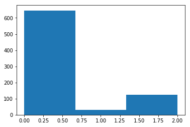


### augmentation of the images NO_VISIBILITY

In the NO_VISIBILITY images we can use rotaion, fliping, zoomig in or zooming out, cropping the images but in the PARTIAL_VISIBILITY we couldn't use crop or shifting because it may change the image to be NO_VISIBILITY class.
#### Rotaion, Shifting, Shearing, Zooming, Flip


```python
indx_NO_VISIBILITY = np.where(y==1)
indx_NO_VISIBILITY
```


    (array([ 11,  27,  75, 123, 154, 187, 203, 219, 235, 251, 267, 283, 299,
            315, 331, 347, 379, 443, 459, 475, 507, 522, 539, 555, 571, 635,
            667, 699, 715, 779, 795], dtype=int64),)


```python
# Count of elements
np.count_nonzero(indx_NO_VISIBILITY)
```


    31


```python
X_NO_VISIBILITY = [X[i] for i in indx_NO_VISIBILITY[0]]
np.array(X_NO_VISIBILITY).shape
```


    (31, 192, 192, 1)


```python
# I intend to create 615 augmented images for NO_VISIBILITY images, then I will have 646 NO_VISIBILITY images 
X_NO_VISIBILITY_Augmented = ImageDataGenerator4NoVisibleImages(X_NO_VISIBILITY, 615)
np.array(X_NO_VISIBILITY_Augmented).shape
```


    (615, 192, 192, 1)


```python
# plto some of NO_VISIBILITY_Augmented images
for i in range(1, 7):
    plt.subplot(2, 3, i)
    plt.imshow(X_NO_VISIBILITY_Augmented[i].reshape(img_rows, img_cols), cmap='gray')
```


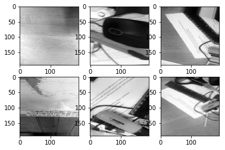


```python
# save the augmented image to disk and add them to X, y dataset
for idx, image in enumerate(X_NO_VISIBILITY_Augmented):
    cv2.imwrite('../data/imagesAugmented/NO_VISIBILITY_' + str(idx) + '.png', image)
    
```


```python
np.array(X_NO_VISIBILITY_Augmented).shape
```


    (615, 192, 192, 1)


```python
np.array(X).shape
```


    (800, 192, 192, 1)


```python
# Extend X_NO_VISIBILITY to the X list
X.extend(X_NO_VISIBILITY_Augmented)
```


```python
np.array(X).shape
```


    (1415, 192, 192, 1)


```python
# insert 615  NO_VISIBILITY value to y 
y_NO_VISIBILITY_Augmented=np.ones(615)
y = np.concatenate((y,y_NO_VISIBILITY_Augmented))
```


```python
y.shape
```


    (1415,)


### augmentation of the images PARTIAL_VISIBILITY

In the PARTIAL_VISIBILITY images we can't use zoomig in or zooming out and cropping the images because these operation can couse change the image to be NO_VISIBILITY class.
#### Rotaion and Fllip


```python
indx_PARTIAL_VISIBILITY = np.where(y==2)
indx_PARTIAL_VISIBILITY
```


    (array([  2,  22,  26,  42,  43,  44,  59,  60,  67,  74,  85,  90,  91,
            106, 107, 117, 121, 122, 129, 132, 134, 138, 139, 155, 156, 165,
            170, 171, 180, 186, 202, 218, 220, 234, 245, 250, 252, 255, 261,
            266, 268, 282, 284, 298, 324, 326, 332, 346, 362, 363, 377, 378,
            394, 395, 396, 410, 411, 426, 427, 428, 437, 441, 442, 453, 458,
            460, 469, 472, 474, 483, 491, 506, 508, 511, 523, 534, 538, 548,
            550, 554, 566, 570, 579, 586, 587, 594, 602, 603, 610, 611, 612,
            614, 617, 618, 619, 634, 636, 650, 651, 659, 665, 666, 682, 683,
            698, 709, 710, 714, 716, 730, 731, 732, 742, 747, 748, 756, 762,
            763, 771, 778, 788, 794, 796], dtype=int64),)


```python
# Count of elements
np.count_nonzero(indx_PARTIAL_VISIBILITY)
```


    123


```python
X_PARTIAL_VISIBILITY = [X[i] for i in indx_PARTIAL_VISIBILITY[0]]
np.array(X_PARTIAL_VISIBILITY).shape
```


    (123, 192, 192, 1)


```python
# I intend to create 523 augmented images for PARTIAL_VISIBILITY images, then I will have 646 PARTIAL_VISIBILITY images
X_PARTIAL_VISIBILITY_Augmented = ImageDataGenerator4PartialVisibleImages(X_PARTIAL_VISIBILITY, 523)
np.array(X_PARTIAL_VISIBILITY_Augmented).shape
```


    (523, 192, 192, 1)


```python
# plto some of PARTIAL_VISIBILITY_Augmented images
for i in range(1, 7):
    plt.subplot(2, 3, i)
    plt.imshow(X_PARTIAL_VISIBILITY_Augmented[i].reshape(img_rows, img_cols), cmap='gray')
```


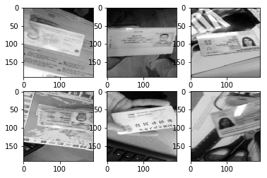


```python
# save the augmented image to disk and add them to X, y dataset
for idx, image in enumerate(X_PARTIAL_VISIBILITY_Augmented):
    cv2.imwrite('../data/imagesAugmented/PARTIAL_VISIBILITY_' + str(idx) + '.png', image)
```


```python
np.array(X_PARTIAL_VISIBILITY_Augmented).shape
```


    (523, 192, 192, 1)


```python
np.array(X).shape
```


    (1415, 192, 192, 1)


```python
# Extend X_NO_VISIBILITY to the X list
X.extend(X_PARTIAL_VISIBILITY_Augmented)
```


```python
np.array(X).shape
```


    (1938, 192, 192, 1)


```python
# insert 523 PARTIAL_VISIBILITY value to y
y_PARTIAL_VISIBILITY_Augmented = np.ones(523)*2
y = np.concatenate((y, y_PARTIAL_VISIBILITY_Augmented))
```


```python
y.shape
```


    (1938,)


#### Using one code encoder to labels y 
     FULL_VISIBILITY==> 0 ==> 1, 0, 0
     NO_VISIBILITY ==> 1 ==> 0, 1, 0
     PARTIAL_VISIBILITY ==> 2 ==> 0, 0, 1


```python
X = np.array(X)
X.shape
```


    (1938, 192, 192, 1)


```python
y = one_hot_encoder(y)
y.shape
```

    unique_values [0. 1. 2.]
    


    (1938, 3)


### train test spliter


```python
# train test split
xTrain, xTest, yTrain, yTest = train_test_split(X, y, test_size = 0.15)
```


```python
print('xTrain.shape: ', xTrain.shape)
print('yTrain.shape: ', yTrain.shape)
print('xTest.shape: ', xTest.shape)
print('yTest.shape: ', yTest.shape)
```

    xTrain.shape:  (1647, 192, 192, 1)
    yTrain.shape:  (1647, 3)
    xTest.shape:  (291, 192, 192, 1)
    yTest.shape:  (291, 3)
    

#### Normalizing the train and test images from 0 to 255 to 0 and 1 


```python
xTrain = xTrain.astype('float32')
xTest = xTest.astype('float32')
xTrain /= 255
xTest /= 255

print('xTrain shape', xTrain.shape)
print(xTrain.shape[0], 'train sample')
print(xTest.shape[0], 'test sample')
```

    xTrain shape (1647, 192, 192, 1)
    1647 train sample
    291 test sample
    

# Classify the images

### Design Sequential model with 2D convolutional Neural Networks


```python
classifier = Sequential()
```


```python
classifier.add(Conv2D(32, kernel_size=(3, 3), 
                      input_shape=(192, 192, 1), 
                      activation = 'relu'))
```


```python
classifier.add(MaxPooling2D(pool_size = (2, 2)))
```


```python
classifier.add(Conv2D(64, (3,3), activation='relu'))
```


```python
classifier.add(MaxPooling2D(pool_size = (2, 2)))
```


```python
classifier.add(Conv2D(64, (3,3), activation='relu'))
```


```python
classifier.add(MaxPooling2D(pool_size = (2, 2)))
```


```python
classifier.add(Conv2D(64, (3,3), activation='relu'))
```


```python
classifier.add(MaxPooling2D(pool_size = (2, 2)))
```


```python
classifier.add(Dropout(0.25))
```


```python
classifier.add(Flatten())
```


```python
classifier.add(Dense(units = 128, activation = 'relu'))
```


```python
classifier.add(Dropout(0.5))
```


```python
classifier.add(Dense(units = num_class, activation = 'softmax'))
```


```python
classifier.summary()
```

    Model: "sequential_2"
    _________________________________________________________________
    Layer (type)                 Output Shape              Param #   
    =================================================================
    conv2d_1 (Conv2D)            (None, 190, 190, 32)      320       
    _________________________________________________________________
    max_pooling2d_1 (MaxPooling2 (None, 95, 95, 32)        0         
    _________________________________________________________________
    conv2d_2 (Conv2D)            (None, 93, 93, 64)        18496     
    _________________________________________________________________
    max_pooling2d_2 (MaxPooling2 (None, 46, 46, 64)        0         
    _________________________________________________________________
    conv2d_3 (Conv2D)            (None, 44, 44, 64)        36928     
    _________________________________________________________________
    max_pooling2d_3 (MaxPooling2 (None, 22, 22, 64)        0         
    _________________________________________________________________
    conv2d_4 (Conv2D)            (None, 20, 20, 64)        36928     
    _________________________________________________________________
    max_pooling2d_4 (MaxPooling2 (None, 10, 10, 64)        0         
    _________________________________________________________________
    dropout_1 (Dropout)          (None, 10, 10, 64)        0         
    _________________________________________________________________
    flatten_1 (Flatten)          (None, 6400)              0         
    _________________________________________________________________
    dense_1 (Dense)              (None, 128)               819328    
    _________________________________________________________________
    dropout_2 (Dropout)          (None, 128)               0         
    _________________________________________________________________
    dense_2 (Dense)              (None, 3)                 387       
    =================================================================
    Total params: 912,387
    Trainable params: 912,387
    Non-trainable params: 0
    _________________________________________________________________
    

### Compile the model


```python
classifier.compile(optimizer = 'adam', 
                   loss = 'categorical_crossentropy', 
                   metrics = ['accuracy'])
```

### fit the model

During my multiple fitting the model and show the validation_accuracy and training_accuracy, the best epochs number for this designed model is 10, because after 10 it will be overfit 

The best value for batch+size is 20 for my designed model


```python
classifier.fit(xTrain, yTrain, 
               batch_size=20, 
               epochs=10, 
               verbose=1, 
               validation_data=(xTest, yTest))
```

    Train on 1647 samples, validate on 291 samples
    Epoch 1/10
    1647/1647 [==============================] - 70s 42ms/step - loss: 0.9898 - accuracy: 0.4718 - val_loss: 0.8474 - val_accuracy: 0.6117
    Epoch 2/10
    1647/1647 [==============================] - 72s 44ms/step - loss: 0.8401 - accuracy: 0.6078 - val_loss: 0.7216 - val_accuracy: 0.6770
    Epoch 3/10
    1647/1647 [==============================] - 71s 43ms/step - loss: 0.6949 - accuracy: 0.6812 - val_loss: 0.6743 - val_accuracy: 0.6976
    Epoch 4/10
    1647/1647 [==============================] - 69s 42ms/step - loss: 0.6108 - accuracy: 0.7195 - val_loss: 0.5577 - val_accuracy: 0.7354
    Epoch 5/10
    1647/1647 [==============================] - 69s 42ms/step - loss: 0.4991 - accuracy: 0.7693 - val_loss: 0.5208 - val_accuracy: 0.7560
    Epoch 6/10
    1647/1647 [==============================] - 75s 45ms/step - loss: 0.4472 - accuracy: 0.8069 - val_loss: 0.4279 - val_accuracy: 0.8179
    Epoch 7/10
    1647/1647 [==============================] - 67s 41ms/step - loss: 0.3332 - accuracy: 0.8616 - val_loss: 0.5340 - val_accuracy: 0.7663
    Epoch 8/10
    1647/1647 [==============================] - 67s 41ms/step - loss: 0.2916 - accuracy: 0.8755 - val_loss: 0.3790 - val_accuracy: 0.8454
    Epoch 9/10
    1647/1647 [==============================] - 70s 43ms/step - loss: 0.2795 - accuracy: 0.8925 - val_loss: 0.3859 - val_accuracy: 0.8076
    Epoch 10/10
    1647/1647 [==============================] - 67s 41ms/step - loss: 0.1896 - accuracy: 0.9326 - val_loss: 0.3065 - val_accuracy: 0.8832
    


    <keras.callbacks.callbacks.History at 0x1a4ef4faf98>


### Show the Score


```python
score = classifier.evaluate(xTest, yTest, verbose=0)
print('The validation accuracy is: ', score[1])
```

    The validation accuracy is:  0.8831614851951599
    

## save the model


```python
# saving the model
model_json = classifier.to_json()
with open("../artifacts/SequentialModel10.json", "w") as json_file:
    json_file.write(model_json)
```


```python
# serialize weights to h5
classifier.save_weights("../artifacts/SequentialModelWeights10.h5")
# save model to h5 file
classifier.save('../artifacts/SequentialModel10.h5')
print("Saved model to disk")
```

    Saved model to disk
    

### summarize history for accuracy


```python
classifier.history.history.keys()
```


    dict_keys(['val_loss', 'val_accuracy', 'loss', 'accuracy'])


```python
plt.plot(classifier.history.history['accuracy'])
plt.plot(classifier.history.history['val_accuracy'])
plt.title('model accuracy')
plt.ylabel('accuracy')
plt.xlabel('epoch')
plt.legend(['train', 'test'], loc='upper left')
```


    <matplotlib.legend.Legend at 0x1a4f707fe10>


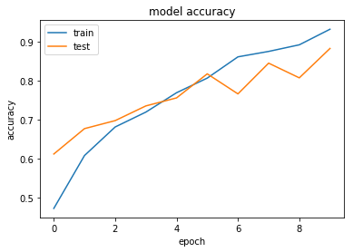


#### we can see the Train and Test Accuracy in the above plot, and we can observe that after epoch 10, the Train and Test accuracy are going far from each other

### summarize history for loss


```python
plt.plot(classifier.history.history['loss'])
plt.plot(classifier.history.history['val_loss'])
plt.title('model loss')
plt.ylabel('loss')
plt.xlabel('epoch')
plt.legend(['train', 'test'], loc='upper left')
```


    <matplotlib.legend.Legend at 0x1a484ab1e10>


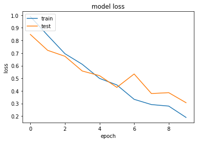


## Test the trained model


```python
# Load the saved model
model = load_model('../artifacts/SequentialModel10.h5')
    
```


```python
# Read the csv file for test
testData = pd.read_csv(test_csvFileAddress, header=0)
data.head()
```


<div>
<style scoped>
    .dataframe tbody tr th:only-of-type {
        vertical-align: middle;
    }

    .dataframe tbody tr th {
        vertical-align: top;
    }

    .dataframe thead th {
        text-align: right;
    }
</style>
<table border="1" class="dataframe">
  <thead>
    <tr style="text-align: right;">
      <th></th>
      <th>IMAGE_FILENAME</th>
      <th>LABEL</th>
    </tr>
  </thead>
  <tbody>
    <tr>
      <th>0</th>
      <td>GICSD_1_0_3.png</td>
      <td>FULL_VISIBILITY</td>
    </tr>
    <tr>
      <th>1</th>
      <td>GICSD_1_0_13.png</td>
      <td>FULL_VISIBILITY</td>
    </tr>
    <tr>
      <th>2</th>
      <td>GICSD_1_1_33.png</td>
      <td>PARTIAL_VISIBILITY</td>
    </tr>
    <tr>
      <th>3</th>
      <td>GICSD_1_1_53.png</td>
      <td>FULL_VISIBILITY</td>
    </tr>
    <tr>
      <th>4</th>
      <td>GICSD_1_2_73.png</td>
      <td>FULL_VISIBILITY</td>
    </tr>
  </tbody>
</table>
</div>


```python
# Read 3 channels images and fill them in the list
test = readRGBImages2List(testData.values[:, 0], test_imagePath, denoised_imagePath, save2disk=False)
np.array(test).shape
```


    (59, 192, 192, 3)


```python
# Plot some of the test images
for i in range(1, 10):
    plt.subplot(3, 3, i)
    plt.imshow(test[i])
```


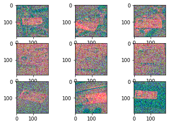


```python
# convert 3 channel RGB and noisy image to clear grayscale 1 channel 
test = denoisedRGB2OneChannel(test)
np.array(xTest).shape
```


    (291, 192, 192, 1)


```python
# Plot some of the denoised images
for i in range(1, 10):
    plt.subplot(3, 3, i)
    plt.imshow(test[i].reshape(img_rows, img_cols), cmap='gray')
    plt.title(testData.values[:, 1][i])
```


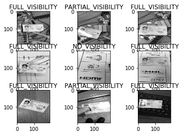


```python
# Encode the labels
y_test = myLabelEncoder(testData.values[:, 1])
y_test.shape
```


    (59,)


```python
# convert the labes to one hot encoders
y_test = one_hot_encoder(y_test)
y_test.shape
```

    unique_values [0 1 2]
    


    (59, 3)


```python
# convert test list to np array
test = np.array(test)
```


```python
# Normalized images to between 0 and 1
test = test.astype('float32')
test /= 255
```


```python
# Predict the test images 
y_predict = model.predict(x=test)
y_predict.shape
```


    (59, 3)


#### because of our test dataset take from training dataset, the accuracy is very high, we can use another test dataset which our model never visit that images 


```python
score = model.evaluate(test, y_test, verbose=0)
print('The test accuracy is: ', score[1])
```

    The test accuracy is:  0.9491525292396545
    


```python

```


```python

```

# Try to use another approche to have better result
I try to use pretraind models like VGG16 in Kras to classify own dataset and fine tune the VGG16 pretrained model
for using it my image should have 3 channel, you can consider the following process 

### Convert 1 channel images to 3 channel images in numpy array


```python
X3Train = GrayscaleImageArray2RGB(xTrain)
```


```python
X3Test = GrayscaleImageArray2RGB(xTest)
```


```python
X3Train.shape
```


    (1647, 192, 192, 3)


### Download and instantiate the VGG16 model


```python
modelVGG16 = VGG16(include_top=False, input_shape=(img_rows, img_cols, 3))
```


```python
# modelVGG16.summary()
```

### Create a Sequential model and copy all the layer of VGG16 to our sequential model


```python
modelSeq=Sequential()
```


```python
for layer in modelVGG16.layers:
    modelSeq.add(layer)
```


```python
for layer in modelSeq.layers:
    layer.traiable=False
```

### Add some layer to our model and finally add the softmax layer with 3 class number


```python
modelSeq.add(Flatten())
```


```python
modelSeq.add(Dense(units = 128, activation = 'relu'))
```


```python
modelSeq.add(Dropout(0.5))
```


```python
modelSeq.add(Dense(units = num_class, activation = 'softmax'))
```


```python
modelSeq.summary()
```

    Model: "sequential_4"
    _________________________________________________________________
    Layer (type)                 Output Shape              Param #   
    =================================================================
    block1_conv1 (Conv2D)        (None, 192, 192, 64)      1792      
    _________________________________________________________________
    block1_conv2 (Conv2D)        (None, 192, 192, 64)      36928     
    _________________________________________________________________
    block1_pool (MaxPooling2D)   (None, 96, 96, 64)        0         
    _________________________________________________________________
    block2_conv1 (Conv2D)        (None, 96, 96, 128)       73856     
    _________________________________________________________________
    block2_conv2 (Conv2D)        (None, 96, 96, 128)       147584    
    _________________________________________________________________
    block2_pool (MaxPooling2D)   (None, 48, 48, 128)       0         
    _________________________________________________________________
    block3_conv1 (Conv2D)        (None, 48, 48, 256)       295168    
    _________________________________________________________________
    block3_conv2 (Conv2D)        (None, 48, 48, 256)       590080    
    _________________________________________________________________
    block3_conv3 (Conv2D)        (None, 48, 48, 256)       590080    
    _________________________________________________________________
    block3_pool (MaxPooling2D)   (None, 24, 24, 256)       0         
    _________________________________________________________________
    block4_conv1 (Conv2D)        (None, 24, 24, 512)       1180160   
    _________________________________________________________________
    block4_conv2 (Conv2D)        (None, 24, 24, 512)       2359808   
    _________________________________________________________________
    block4_conv3 (Conv2D)        (None, 24, 24, 512)       2359808   
    _________________________________________________________________
    block4_pool (MaxPooling2D)   (None, 12, 12, 512)       0         
    _________________________________________________________________
    block5_conv1 (Conv2D)        (None, 12, 12, 512)       2359808   
    _________________________________________________________________
    block5_conv2 (Conv2D)        (None, 12, 12, 512)       2359808   
    _________________________________________________________________
    block5_conv3 (Conv2D)        (None, 12, 12, 512)       2359808   
    _________________________________________________________________
    block5_pool (MaxPooling2D)   (None, 6, 6, 512)         0         
    _________________________________________________________________
    flatten_3 (Flatten)          (None, 18432)             0         
    _________________________________________________________________
    dense_5 (Dense)              (None, 128)               2359424   
    _________________________________________________________________
    dropout_4 (Dropout)          (None, 128)               0         
    _________________________________________________________________
    dense_6 (Dense)              (None, 3)                 387       
    =================================================================
    Total params: 17,074,499
    Trainable params: 17,074,499
    Non-trainable params: 0
    _________________________________________________________________
    

### Compile the model


```python
modelSeq.compile(optimizer = 'adam', 
                   loss = 'categorical_crossentropy', 
                   metrics = ['accuracy'])
```

### Train the model
You can follow the results after finishing the training

#### It can continue in the future work, or we can use another keras applications like Xception, ResNet, Inception, MobileNet, DenseNet and ... to increase the accuracy
I stoped the training because it takes a lot of times in my laptop.


```python
modelSeq.fit(X3Train, yTrain, 
               batch_size=20, 
               epochs=10, 
               verbose=1, 
               validation_data=(X3Test, yTest))
```

    Train on 1647 samples, validate on 291 samples
    Epoch 1/10
    1647/1647 [==============================] - 1373s 834ms/step - loss: 1.3864 - accuracy: 0.3376 - val_loss: 1.0986 - val_accuracy: 0.3436
    Epoch 2/10
     200/1647 [==>...........................] - ETA: 19:31 - loss: 1.0982 - accuracy: 0.3450


    ---------------------------------------------------------------------------

    KeyboardInterrupt                         Traceback (most recent call last)

    <ipython-input-206-4ccbc4285f13> in <module>
          3                epochs=10,
          4                verbose=1,
    ----> 5                validation_data=(X3Test, yTest))
    

    C:\ProgramData\Anaconda3\lib\site-packages\keras\engine\training.py in fit(self, x, y, batch_size, epochs, verbose, callbacks, validation_split, validation_data, shuffle, class_weight, sample_weight, initial_epoch, steps_per_epoch, validation_steps, validation_freq, max_queue_size, workers, use_multiprocessing, **kwargs)
       1237                                         steps_per_epoch=steps_per_epoch,
       1238                                         validation_steps=validation_steps,
    -> 1239                                         validation_freq=validation_freq)
       1240 
       1241     def evaluate(self,
    

    C:\ProgramData\Anaconda3\lib\site-packages\keras\engine\training_arrays.py in fit_loop(model, fit_function, fit_inputs, out_labels, batch_size, epochs, verbose, callbacks, val_function, val_inputs, shuffle, initial_epoch, steps_per_epoch, validation_steps, validation_freq)
        194                     ins_batch[i] = ins_batch[i].toarray()
        195 
    --> 196                 outs = fit_function(ins_batch)
        197                 outs = to_list(outs)
        198                 for l, o in zip(out_labels, outs):
    

    C:\ProgramData\Anaconda3\lib\site-packages\tensorflow_core\python\keras\backend.py in __call__(self, inputs)
       3738         value = math_ops.cast(value, tensor.dtype)
       3739       converted_inputs.append(value)
    -> 3740     outputs = self._graph_fn(*converted_inputs)
       3741 
       3742     # EagerTensor.numpy() will often make a copy to ensure memory safety.
    

    C:\ProgramData\Anaconda3\lib\site-packages\tensorflow_core\python\eager\function.py in __call__(self, *args, **kwargs)
       1079       TypeError: For invalid positional/keyword argument combinations.
       1080     """
    -> 1081     return self._call_impl(args, kwargs)
       1082 
       1083   def _call_impl(self, args, kwargs, cancellation_manager=None):
    

    C:\ProgramData\Anaconda3\lib\site-packages\tensorflow_core\python\eager\function.py in _call_impl(self, args, kwargs, cancellation_manager)
       1119       raise TypeError("Keyword arguments {} unknown. Expected {}.".format(
       1120           list(kwargs.keys()), list(self._arg_keywords)))
    -> 1121     return self._call_flat(args, self.captured_inputs, cancellation_manager)
       1122 
       1123   def _filtered_call(self, args, kwargs):
    

    C:\ProgramData\Anaconda3\lib\site-packages\tensorflow_core\python\eager\function.py in _call_flat(self, args, captured_inputs, cancellation_manager)
       1222     if executing_eagerly:
       1223       flat_outputs = forward_function.call(
    -> 1224           ctx, args, cancellation_manager=cancellation_manager)
       1225     else:
       1226       gradient_name = self._delayed_rewrite_functions.register()
    

    C:\ProgramData\Anaconda3\lib\site-packages\tensorflow_core\python\eager\function.py in call(self, ctx, args, cancellation_manager)
        509               inputs=args,
        510               attrs=("executor_type", executor_type, "config_proto", config),
    --> 511               ctx=ctx)
        512         else:
        513           outputs = execute.execute_with_cancellation(
    

    C:\ProgramData\Anaconda3\lib\site-packages\tensorflow_core\python\eager\execute.py in quick_execute(op_name, num_outputs, inputs, attrs, ctx, name)
         59     tensors = pywrap_tensorflow.TFE_Py_Execute(ctx._handle, device_name,
         60                                                op_name, inputs, attrs,
    ---> 61                                                num_outputs)
         62   except core._NotOkStatusException as e:
         63     if name is not None:
    

    KeyboardInterrupt: 


```python

```
